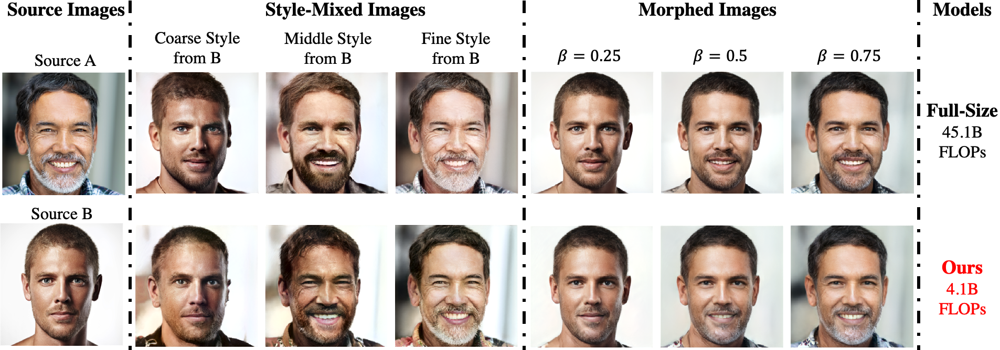
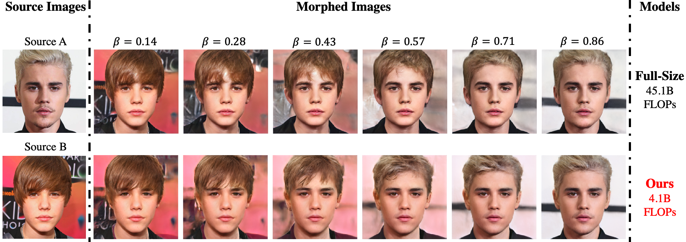
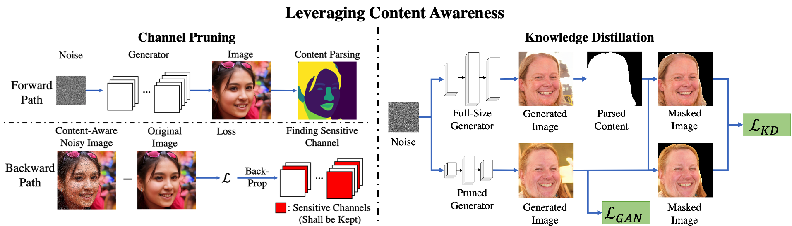
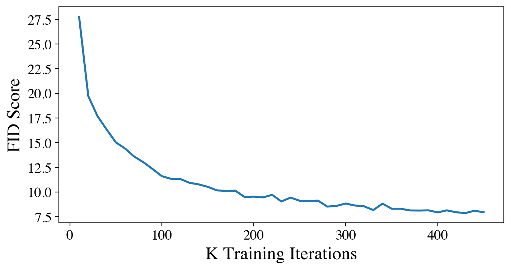

# Content-Aware GAN Compression [[ArXiv]](https://arxiv.org/abs/2104.02244)

Paper accepted to CVPR2021. 
```BibTex
@inproceedings{liu2021content,
  title     = {Content-Aware GAN Compression},
  author    = {Liu, Yuchen and Shu, Zhixin and Li, Yijun and Lin, Zhe and Perazzi, Federico and Kung, S.Y.},
  booktitle = {IEEE Conference on Computer Vision and Pattern Recognition (CVPR)},
  year      = {2021},
}
```


## Overview

We propose a novel content-aware approach for GAN compression. With content-awareness, our **11x-accelerated** GAN performs comparably with the full-size model on image generation and image editing.

### Image Generation


<a></a>

We show an example above on the generative ability of our **11x-accelerated** generator vs. the full-size one. In particular, our model generates the interested contents visually comparable to the full-size model.


### Image Editing

<a></a>

We show an example typifying the effectiveness of our compressed StyleGAN2 for image style-mixing and morphing above. When we mix middle styles from B, the original full-size model has a significant identity loss, while our approach better preserves the person’s identity. We also observe that our morphed images have a smoother expression transition compared the full-size model in the beard, substantiating our advantage in latent space smoothness.


<a></a>

We provide an additional example above.


## Methodology


<a></a>

In our work, we make the first attempt to bring content awareness into channel pruning and knowledge distillation.

Specifically, we leverage a content-parsing network to identify contents of interest (COI), a set of spatial locations with salient semantic concepts, within the generated images. We design a content-aware pruning metric (with a forward and backward path) to remove channels that are least sensitive to COI in the generated images. For knowledge distillation, we focus our distillation region only to COI of the teacher’s outputs which further enhances target contents’ distillation.


## Usage


### Prerequisite

We have tested our codes under the following environments:

```bash
python == 3.6.5
pytorch == 1.6.0
torchvision == 0.7.0
CUDA == 10.2
```


### Pretrained Full-Size Generator Checkpoint

To start with, you can first download a full-size generator checkpoint from:

[256px StyleGAN2](https://drive.google.com/file/d/1LuOvwRvIV-OXbvsW08LK0nVrEM1tBxoN/view?usp=sharing)

[1024px StyleGAN2](https://drive.google.com/file/d/1MZR-_dLFJO0wbIkg_Ay5LhRokKHcHcsW/view?usp=sharing)

and place it under the folder `./Model/full_size_model/`.


### Pruning

Once you get the full-size checkpoint, you can prune the generator by:

```bash
python3 prune.py \
	--generated_img_size=256 \
	--ckpt=/path/to/full/size/model/ \
	--remove_ratio=0.7 \
	--info_print
``` 

We adopt a uniform channel pruning ratio for every layer. Above procedure will remove 70% of channels from the generator in each layer. The pruned checkpoint will be saved at `./Model/pruned_model/`.


### Retraining

We then retrain the pruned generator by:

```bash
python3 train.py \
	--size=256 \
	--path=/path/to/ffhq/data/folder/ \
	--ckpt=/path/to/pruned/model/ \
	--teacher_ckpt=/path/to/full/size/model/ \
	--iter=450001 \
	--batch_size=16
``` 

You may adjust the variables `gpu_device_ids` and `primary_device` for the GPU setup in `train_hyperparams.py`.


### Training Log

The time for retraining 11x-compressed models on V100 GPUs: 

|       Model      | Batch Size | Iterations | # GPUs | Time (Hour) |
|:----------------:|:----------:|:----------:|:------:|:-----------:|
|  256px StyleGAN2 |     16     |    450k    |    2   |     131     |
| 1024px StyleGAN2 |     16     |    450k    |    4   |     251     |
|                  |            |            |        |             |


A typical training curve for the 11x-compressed 256px StyleGAN2:

<a></a>


### Evaluation

To evaluate the model quantitatively, we provide `get_fid.py` and `get_ppl.py` to get model's FID and PPL sores.

FID Evaluation:

```bash
python3 get_fid.py \
	--generated_img_size=256 \
	--ckpt=/path/to/model/ \
	--n_sample=50000 \
	--batch_size=64 \
	--info_print
``` 


PPL Evaluation: 

```bash
python3 get_ppl.py \
	--generated_img_size=256 \
	--ckpt=/path/to/model/ \
	--n_sample=5000 \
	--eps=1e-4 \
	--info_print
``` 


We also provide an image projector which return a (real image, projected image) pair in `Image_Projection_Visualization.png` as well as the PSNR and LPIPS score between this pair:

```bash
python3 get_projected_image.py \
	--generated_img_size=256 \
	--ckpt=/path/to/model/ \
	--image_file=/path/to/an/RGB/image/ \
	--num_iters=800 \
	--info_print
``` 

An example of `Image_Projection_Visualization.png` projected by a full-size 256px StyleGAN2:

<a></a>


### Helen-Set55

We provide the Helen-Set55 on [Google Drive](https://drive.google.com/file/d/1yp8YswwlKgFHOp6Co4VQzvnS6adUfCDa/view?usp=sharing).


### 11x-Accelerated Generator Checkpoint

We provide the following checkpoints of our content-aware compressed StyleGAN2: 

[Compressed 256px StyleGAN2](https://drive.google.com/file/d/1xo3rfoy2nKchmKkKUoYnixTxeepN-0Xw/view?usp=sharing)

[Compressed 1024px StyleGAN2](https://drive.google.com/file/d/1ojs4OdF6sUVwuXZJK6sGZVjUxqQl8_n7/view?usp=sharing)


## Acknowledgement

PyTorch StyleGAN2: https://github.com/rosinality/stylegan2-pytorch

Face Parsing BiSeNet: https://github.com/zllrunning/face-parsing.PyTorch

Fréchet Inception Distance: https://github.com/mseitzer/pytorch-fid

Learned Perceptual Image Patch Similarity: https://github.com/richzhang/PerceptualSimilarity
